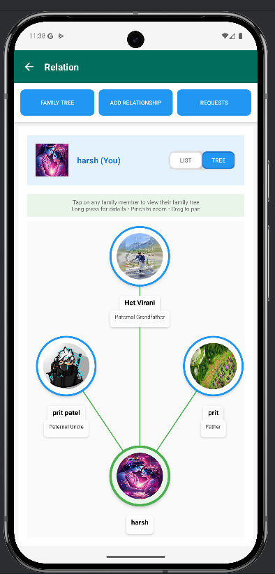
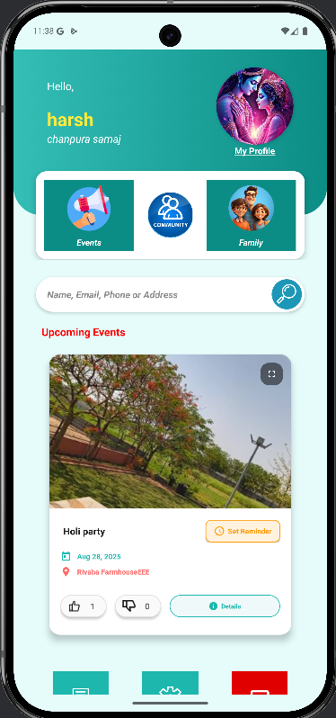

# 📱 SamajConnect – A Community Networking & Engagement Platform

[](https://hetvirani.github.io/Digital-Portfolio/)
[](https://github.com/Hetvirani)
[](https://www.linkedin.com/in/het-virani/)

---

## 📌 Overview

**SamajConnect** is an Android-based community networking and engagement platform developed during an internship at **BISAG-N** (Bhaskaracharya National Institute for Space Applications and Geo-Informatics). It enables users to:

- Create and manage Samaj (community) groups
- Explore dynamic family trees
- Send and accept relation requests
- Participate in events

It bridges traditional community culture with modern technology.

---

## 🎯 Key Features

- 👨‍👩‍👧‍👦 **Dynamic Relationship Mapping:**  
  Tree-based, generation-wise visualization of family connections

- 👥 **User & Admin Access:**  
  Authentication for both regular members and administrators

- 🗂️ **Profile Management:**  
  View and edit member details, search relatives, and explore connections

- 🏡 **Event Management:**  
  View upcoming events

---

## ⚙️ Tech Stack

| Layer | Technology |
|-------|------------|
| Frontend | Java, Android SDK, XML, Canvas API |
| Backend | Spring Boot, REST APIs |
| Database | PostgreSQL |
| Tools | Android Studio, VS Code, GitHub |

---

## 📂 Project Structure

```
SamajConnect/
├── SamajConnectFrontEnd/     # Android app code
│   ├── app/
│   ├── .gradle/
│   └── ...
├── SamajConnectBackEnd/      # Spring Boot backend
│   ├── src/
│   └── target/
├── docs/                     # Report, presentation, screenshots
├── README.md
└── .gitignore
```

---

## 🛠️ Setup & Installation

### 🔧 Prerequisites

- Android Studio
- Java JDK 11+
- PostgreSQL
- Spring Boot (installed or via IntelliJ/VS Code)

---

### 🧪 Steps to Run

1. **Clone the repo**
   ```bash
   git clone https://github.com/Hetvirani/SamajConnect-A-Community-Networking-Engagement-Platform-.git
   ```

2. **Open frontend in Android Studio**
   - Sync Gradle
   - Set up Firebase credentials in `google-services.json`

3. **Set up backend**
   - Configure PostgreSQL DB credentials in `application.properties`
   - Run the Spring Boot app

4. **Launch the app**
   - Login or Sign up
   - Explore family trees, events, and admin dashboard

---

## 🧠 Functional Modules

- 👤 **User Authentication**
- 🌳 **Family Tree Mapping**
- 📨 **Relation Request Flow**
- 🗓️ **Event Participation**
- 🔍 **Member Search & Filter**
- 🛠️ **Admin Dashboard for Samaj Management**

---

## 📸 Screenshots

| Family Tree View | Event Page | Admin Dashboard |
|------------------|------------|-----------------|
|  |  |  |

---

## 🧾 Documentation

You can find the full project report, diagrams, and more inside the `/docs/` folder.

- ✅ Report PDF (`2025G093.pdf`)
- ✅ Circuit Diagram / Family Tree Flow

---

## 👨‍💻 Author

**Het Virani**  
📧 Email: hetvirani1305@gmail.com  
🔗 [LinkedIn](https://www.linkedin.com/in/het-virani/) | [GitHub](https://github.com/Hetvirani)

---

> “Connecting Communities with Code 💻🌐”  
> Built during internship @ BISAG-N
